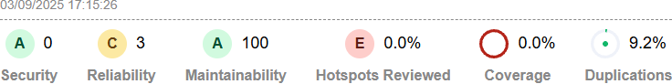

# Ecommerce Nestjs

This project is the server-side component of an ecommerce system, built with NestJS. It provides RESTful APIs for both clients and administrators. Clients can register, log in, browse products, place orders, and make payments. Administrators can manage products, orders, users, and access reporting features.

## Main Technologies Used

- **NestJS**: Main server-side framework (`@nestjs/*` packages).
- **MongoDB & Mongoose**: NoSQL database and ODM.
- **JWT**: Authentication with JSON Web Tokens.
- **Bull & @nestjs/bull**: Queue management for background jobs.
- **Socket.IO**: Real-time communication via WebSocket.
- **Class-validator & class-transformer**: Input validation and transformation.
- **Nodemailer**: Sending emails.
- **Firebase Admin**: Integration with Firebase services.
- **Sharp, fluent-ffmpeg, pdf-to-printer, puppeteer**: Image, video, PDF, and browser automation utilities.
- **Winston**: Logging.
- **nestjs-i18n**: Internationalization (i18n).
- **EJS**: Templating engine.
- **Axios**: HTTP client for external APIs.
- **Cheerio**: HTML parsing.
- **Prettier, ESLint, Jest, Supertest**: Code formatting, linting, unit and e2e testing.
- **TypeScript**: Main programming language.

These technologies together provide a robust, scalable, and maintainable backend for the ecommerce

## SonarQube Report
